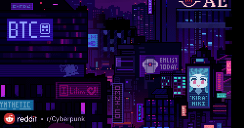

<div align="center">

<!-- Animated header banner -->


<br/>

<!-- Typing SVG -->
<svg width="100%" viewBox="0 0 680 340" role="img" xmlns="http://www.w3.org/2000/svg">
  <title>Suvani Waghmare — Technical Storyteller, Aspiring Data Scientist, Web Developer</title>
  <desc>Portfolio banner for Suvani Waghmore's GitHub README</desc>

  <style>
    .bg { fill: #0d1117; }
    .white { fill: #ffffff; }
    .muted { fill: #8b949e; }
    .card { fill: #161b22; stroke: #30363d; stroke-width: 0.5; }
    .tag-py { fill: #1f3a52; }
    .tag-js { fill: #3a3000; }
    .tag-ml { fill: #1f2d1f; }
    .tag-py-t { fill: #79c0ff; }
    .tag-js-t { fill: #e3b341; }
    .tag-ml-t { fill: #56d364; }
    .bar-bg { fill: #21262d; }
    .dim { fill: #484f58; }
    .mono { font-family: 'Courier New', monospace; }
    .sans { font-family: -apple-system, BlinkMacSystemFont, 'Segoe UI', sans-serif; }
  </style>

  <!-- Background -->
  <rect width="680" height="340" rx="12" class="bg"/>

  <!-- Left accent bar -->
  <rect x="0" y="0" width="3" height="340" rx="1.5" fill="#ff00ff"/>

  <!-- Name -->
  <text x="32" y="46" class="sans white" font-size="28" font-weight="700" letter-spacing="-0.5">Suvani Waghmore</text>
  <text x="32" y="68" class="sans muted" font-size="13">Technical Storyteller · Aspiring Data Scientist · Web Developer</text>

  <!-- Divider line -->
  <rect x="32" y="84" width="140" height="1" fill="#ff00ff" opacity="0.4"/>

  <!-- Tagline -->
  <text x="32" y="108" class="mono" fill="#ff00ff" font-size="11">&gt; </text>
  <text x="48" y="108" class="mono muted" font-size="11">"I turn raw data into brand narratives."</text>
  <text x="32" y="132" class="sans" fill="#8b949e" font-size="11">B.Tech CSE · Data Science &amp; ML · Open to Internships</text>

  <!-- Tech pills -->
  <rect x="32" y="152" width="56" height="20" rx="10" class="tag-py"/>
  <text x="60" y="165" text-anchor="middle" class="sans tag-py-t" font-size="11" font-weight="500">Python</text>

  <rect x="96" y="152" width="72" height="20" rx="10" class="tag-js"/>
  <text x="132" y="165" text-anchor="middle" class="sans tag-js-t" font-size="11" font-weight="500">JavaScript</text>

  <rect x="176" y="152" width="62" height="20" rx="10" class="tag-ml"/>
  <text x="207" y="165" text-anchor="middle" class="sans tag-ml-t" font-size="11" font-weight="500">ML / DS</text>

  <rect x="246" y="152" width="60" height="20" rx="10" fill="#2d1f3a" stroke="#30363d" stroke-width="0.5"/>
  <text x="276" y="165" text-anchor="middle" class="sans" fill="#d2a8ff" font-size="11" font-weight="500">Tailwind</text>

  <rect x="314" y="152" width="50" height="20" rx="10" fill="#2d1f1f" stroke="#30363d" stroke-width="0.5"/>
  <text x="339" y="165" text-anchor="middle" class="sans" fill="#ffa198" font-size="11" font-weight="500">Pandas</text>

  <!-- Skills section -->
  <text x="32" y="200" class="sans dim" font-size="10" font-weight="500" letter-spacing="1">SKILLS</text>

  <text x="32" y="220" class="sans muted" font-size="11">Python</text>
  <rect x="80" y="211" width="100" height="6" rx="3" class="bar-bg"/>
  <rect x="80" y="211" width="92" height="6" rx="3" fill="#ff00ff"/>

  <text x="32" y="238" class="sans muted" font-size="11">JavaScript</text>
  <rect x="80" y="229" width="100" height="6" rx="3" class="bar-bg"/>
  <rect x="80" y="229" width="75" height="6" rx="3" fill="#7f77dd"/>

  <text x="32" y="256" class="sans muted" font-size="11">Data &amp; ML</text>
  <rect x="80" y="247" width="100" height="6" rx="3" class="bar-bg"/>
  <rect x="80" y="247" width="68" height="6" rx="3" fill="#1d9e75"/>

  <text x="32" y="276" class="sans muted" font-size="11">Writing</text>
  <rect x="80" y="267" width="100" height="6" rx="3" class="bar-bg"/>
  <rect x="80" y="267" width="93" height="6" rx="3" fill="#e3b341"/>

  <!-- Vertical divider -->
  <line x1="220" y1="185" x2="220" y2="300" stroke="#21262d" stroke-width="0.5"/>

  <!-- Projects section -->
  <text x="240" y="200" class="sans dim" font-size="10" font-weight="500" letter-spacing="1">PROJECTS</text>

  <rect x="240" y="208" width="400" height="30" rx="6" class="card"/>
  <text x="254" y="227" class="sans white" font-size="12" font-weight="500">My-Portfolio-DEMO</text>
  <rect x="536" y="213" width="58" height="18" rx="4" class="tag-js"/>
  <text x="565" y="225" text-anchor="middle" class="sans tag-js-t" font-size="10">HTML · JS</text>

  <rect x="240" y="245" width="400" height="30" rx="6" class="card"/>
  <text x="254" y="264" class="sans white" font-size="12" font-weight="500">Manexa Dashboard</text>
  <rect x="536" y="250" width="58" height="18" rx="4" class="tag-ml"/>
  <text x="565" y="262" text-anchor="middle" class="sans tag-ml-t" font-size="10">Python</text>

  <rect x="240" y="282" width="400" height="30" rx="6" class="card"/>
  <text x="254" y="301" class="sans white" font-size="12" font-weight="500">Movie Dataset Analysis</text>
  <rect x="536" y="287" width="58" height="18" rx="4" class="tag-py"/>
  <text x="565" y="299" text-anchor="middle" class="sans tag-py-t" font-size="10">Pandas</text>

  <!-- Avatar circle -->
  <circle cx="648" cy="50" r="28" fill="#21262d" stroke="#ff00ff" stroke-width="1"/>
  <text x="648" y="45" text-anchor="middle" class="sans" fill="#ff00ff" font-size="18" font-weight="700">SW</text>
  <text x="648" y="60" text-anchor="middle" class="sans" fill="#8b949e" font-size="8">available</text>
  <circle cx="648" cy="83" r="4" fill="#56d364"/>
  <text x="655" y="87" class="sans" fill="#56d364" font-size="9">for hire</text>

  <!-- Footer -->
  <text x="32" y="320" class="sans dim" font-size="10">linkedin · github · x · suvaniwaghmore02@gmail.com</text>
  <text x="640" y="320" text-anchor="end" class="sans dim" font-size="10">© 2025 Suvani Waghmore</text>
</svg>

<br/><br/>

<!-- Social badges -->
[](https://www.linkedin.com/in/suvani-waghmare)
[](https://github.com/suvaniwaghmare085-droid)
[-000000?style=for-the-badge&logo=x&logoColor=white)](https://x.com/SuvaniW61316)
[](mailto:suvaniwaghmore02@gmail.com)
[](https://my-portfolio-demo-eta.vercel.app/)

<br/>

<!-- Profile views -->


</div>

---

## 🌟 About Me

```python
class Suvani:
    name        = "Suvani Waghmare"
    role        = "Technical Storyteller · Aspiring Data Scientist · Web Developer"
    education   = "B.Tech CSE — Data Science & Machine Learning"
    tagline     = "I turn raw data into brand narratives."
    
    skills = {
        "languages":  ["Python", "JavaScript", "Java", "C"],
        "web":        ["HTML5", "CSS3", "Tailwind CSS", "Responsive Design"],
        "data_ml":    ["Pandas", "Plotly", "Jupyter", "Machine Learning"],
        "soft_skills":["Content Writing", "Brand Storytelling", "Social Media"]
    }
    
    currently  = ["Building ML models 🤖", "Exploring data storytelling 📊", "Open to internships 🚀"]
    fun_fact   = "I believe the best code tells a story — even to non-coders."
```

---

## 🚀 Live Portfolio

<div align="center">

| 🌐 Platform | 🔗 Link |
|:---:|:---:|
| **GitHub Pages** | [suvaniwaghmare085-droid.github.io/My-Portfolio-DEMO](https://suvaniwaghmare085-droid.github.io/My-Portfolio-DEMO/) |
| **Vercel** | [my-portfolio-demo-eta.vercel.app](https://my-portfolio-demo-eta.vercel.app/) |

</div>

---

## 🛠️ Tech Stack

<div align="center">

### Languages


### Web Development


### Data Science & ML


### Tools & Platforms


</div>

---

## 📂 Featured Projects

<div align="center">

| # | Project | Description | Stack | Status |
|:--:|:--------|:------------|:------|:------:|
| 🏆 | [**My-Portfolio-DEMO**](https://github.com/suvaniwaghmare085-droid/My-Portfolio-DEMO) | Animated personal portfolio — a modern showcase of my skills and journey | `HTML` `Tailwind` `JS` | ✅ Live |
| 📊 | [**Manexa-Sample-Dashboard**](https://github.com/suvaniwaghmare085-droid/Manexa-sample-dashboard) | Interactive sales & analytics dashboard with dynamic visualizations | `Python` `Pandas` `Plotly` | 🚧 In Dev |
| 🎮 | [**Quiz-Game**](https://github.com/suvaniwaghmare085-droid/Quiz-Game) | Story-driven interactive quiz blending logic & creativity | `HTML` `CSS` `JS` | ✅ Live |
| 🎬 | [**Movie-Dataset-Project**](https://github.com/suvaniwaghmare085-droid/Movie-Dataset-Project) | Data analysis & visualization on an IMDb movie dataset | `Python` `Pandas` `Jupyter` | ✅ Done |
| 🐛 | [**Bug-Hunt-Game**](https://github.com/suvaniwaghmare085-droid/Bug-Hunt-game) | Fun browser-based bug hunting game to practice interactivity | `HTML` `CSS` `JS` | ✅ Live |

</div>

---

## 📈 GitHub Stats

<div align="center">


<br/>


<br/><br/>

<!-- GitHub activity graph -->


</div>

---

## 🏅 Achievements & Trophies

<div align="center">


</div>

---

## 🎯 What I'm Working On

```text
🔭 Currently Building  →  Manexa Analytics Dashboard (Python + Plotly)
🌱 Currently Learning  →  Machine Learning & Deep Learning fundamentals
👯 Open To Collaborate →  Web Dev projects, Data Viz, Creative Tech
🤔 Seeking Help With   →  Advanced ML architectures & model deployment
💬 Ask Me About        →  Data storytelling, web dev, content strategy
⚡ Fun Fact            →  I blend code with creative writing — storytelling is my superpower
```

---

## 📝 My Philosophy

<div align="center">

> *"Data without a story is just noise. I make it music."*

</div>

I believe the intersection of **technical skill** and **creative communication** is where real impact happens. Whether I'm building an ML model or writing a brand narrative, I bring the same curiosity and intention to every project.

---

## 📫 Let's Connect

<div align="center">

| Platform | Handle |
|:--------:|:------:|
| 💼 LinkedIn | [suvani-waghmore](https://www.linkedin.com/in/suvani-waghmore) |
| 🐙 GitHub | [suvaniwaghmare085-droid](https://github.com/suvaniwaghmare085-droid) |
| 🐦 X (Twitter) | [@SuvaniW61316](https://x.com/SuvaniW61316) |
| 📧 Email | [suvaniwaghmore02@gmail.com](mailto:suvaniwaghmore02@gmail.com) |

<br/>

[](https://raw.githubusercontent.com/suvaniwaghmare085-droid/My-Portfolio-DEMO/main/Suvani_Waghmore_CV.pdf)

</div>

---

<div align="center">



<br/>

**Open to internships · collaborations · mentorship opportunities**

<br/>

*Made with ❤️ by Suvani Waghmore*


</div>
